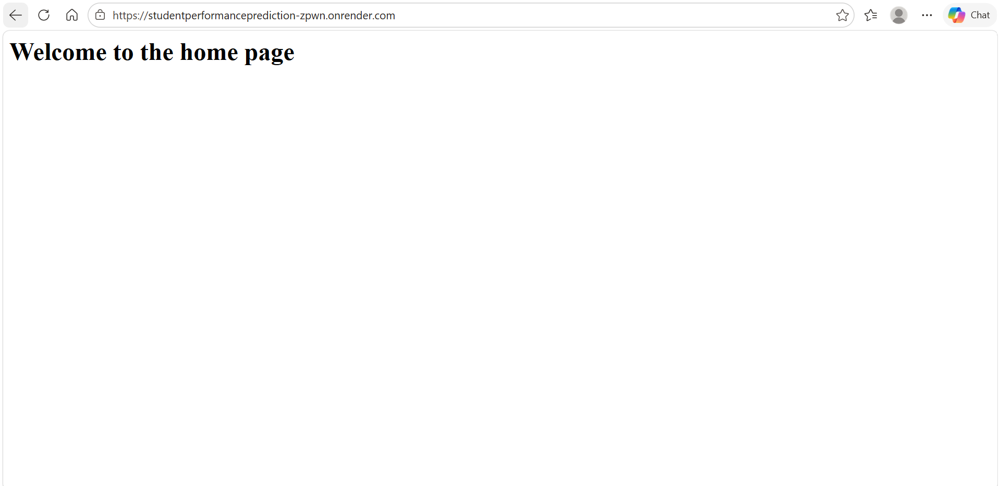
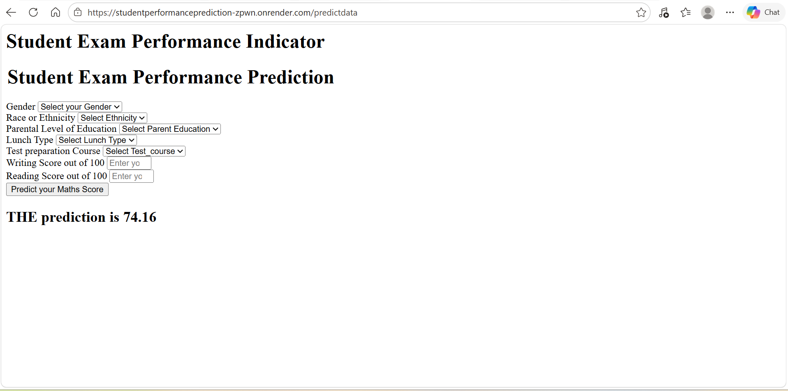

# Student Exam Performance Predictor

A Machine Learning web application that predicts a student's Maths score based on demographic and academic input features.

## Live Demo

Deployed on Render:

```text
https://studentperformanceprediction-zpwn.onrender.com/
```

---

# Project Overview

This project uses a Machine Learning Regression model to predict student Maths performance using:

* Gender
* Race/Ethnicity
* Parental Level of Education
* Lunch Type
* Test Preparation Course
* Reading Score
* Writing Score

The application is built using:

* Python
* Flask
* Scikit-learn
* CatBoost
* XGBoost
* HTML/CSS

---

# Features

* Student score prediction
* Interactive web interface
* ML pipeline integration
* Model deployment using Flask
* Hosted on Render
* End-to-end ML workflow

---

# Tech Stack

## Backend

* Python
* Flask

## Machine Learning

* Scikit-learn
* CatBoost
* XGBoost
* Pandas
* NumPy

## Frontend

* HTML

## Deployment

* Render
* Gunicorn

---

# Project Structure

```bash
MLStudentRegression/
│
├── artifacts/
│   ├── model.pkl
│   └── preprocessor.pkl
│
├── notebooks/
│
├── src/
│   ├── components/
│   ├── pipeline/
│   ├── exception.py
│   ├── logger.py
│   └── utils.py
│
├── templates/
│   ├── home.html
│   └── index.html
│
├── app.py
├── requirements.txt
├── setup.py
└── README.md
```

---

# Installation

## Clone the repository

```bash
git clone https://github.com/prerna-m01/StudentPerformancePrediction
```

## Navigate to project folder

```bash
cd your-repo-name
```

## Create virtual environment

```bash
python -m venv venv
```

## Activate virtual environment

### Windows

```bash
venv\Scripts\activate
```

### Linux/Mac

```bash
source venv/bin/activate
```

---

# Install Dependencies

```bash
pip install -r requirements.txt
```

---

# Run the Application

```bash
python app.py
```

Open in browser:

```text
http://127.0.0.1:5000
```

---

# Deployment on Render

## Build Command

```bash
pip install -r requirements.txt
```

## Start Command

```bash
gunicorn app:app
```

---

# ML Workflow

1. Data Ingestion
2. Data Preprocessing
3. Model Training
4. Model Evaluation
5. Prediction Pipeline
6. Flask Deployment

---

# Future Improvements

* FastAPI integration
* Dockerization
* CI/CD pipeline
* Better UI/UX
* Model monitoring
* Automated retraining
* Cloud deployment

---

# Screenshots

## Home Page



## Prediction Page



---

# Author

Prerna Mishra

---

